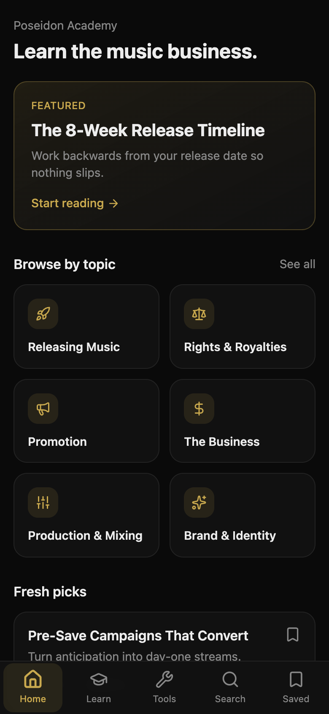
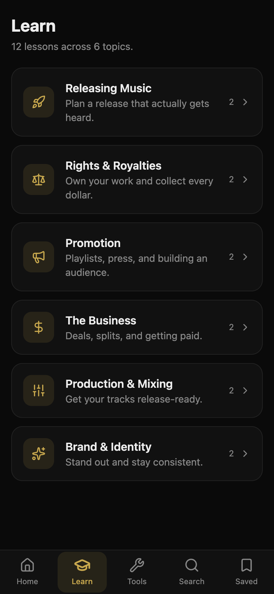
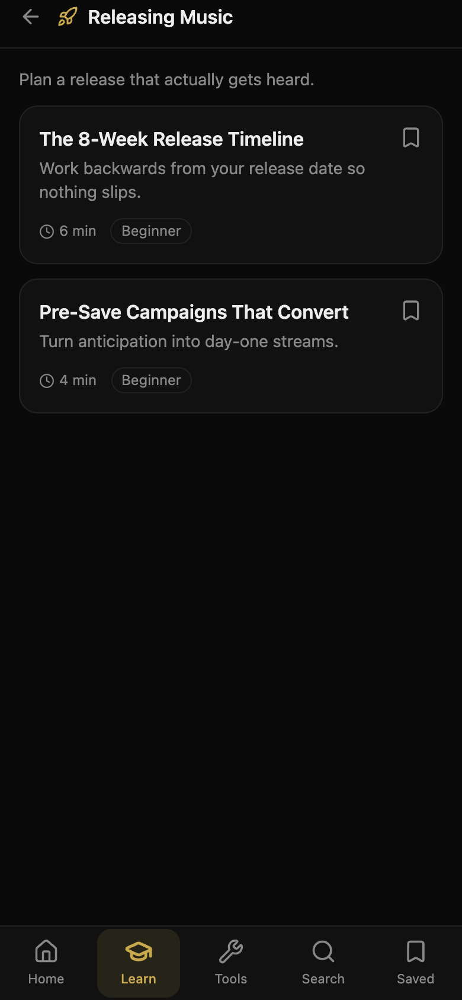
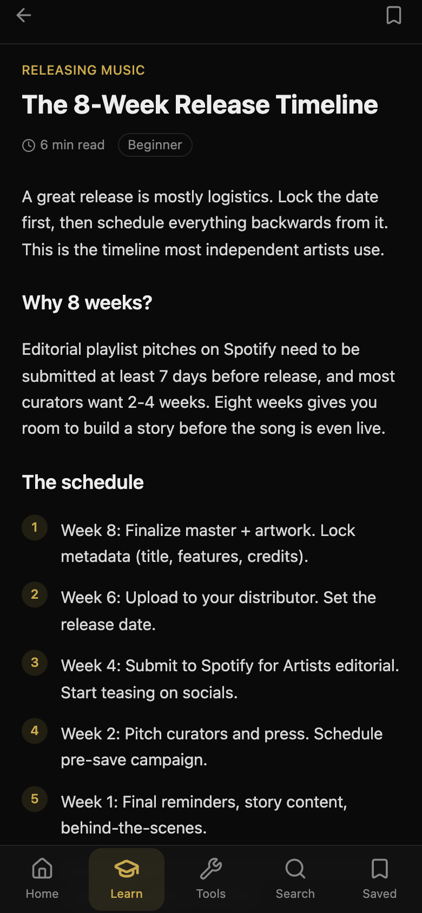
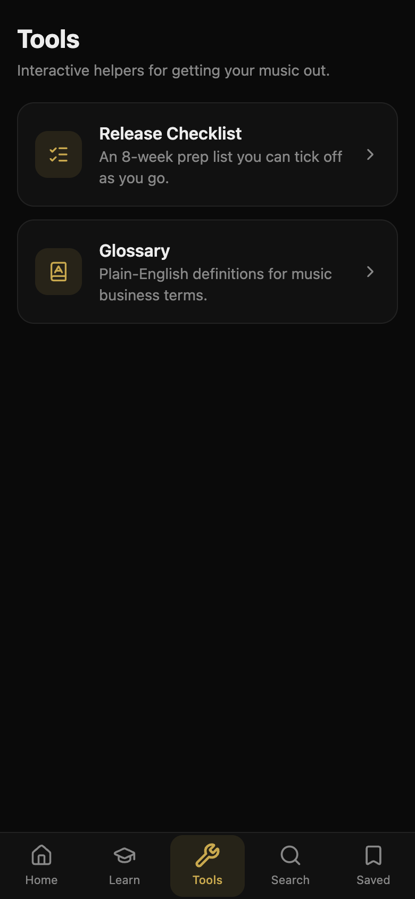
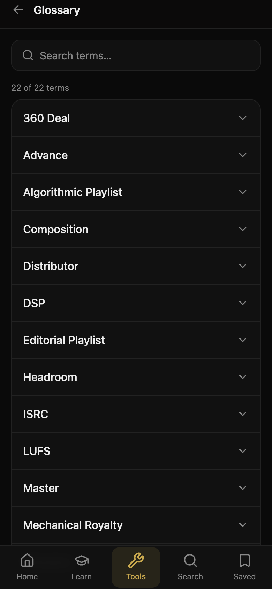
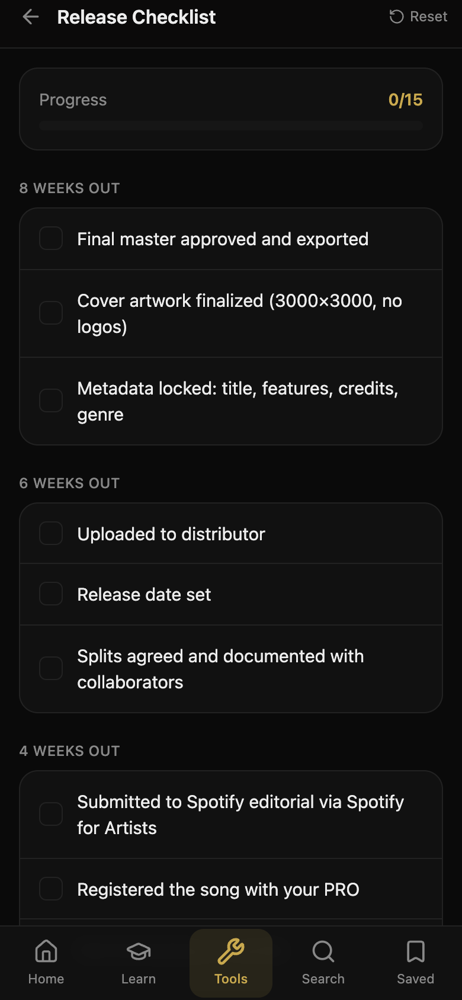
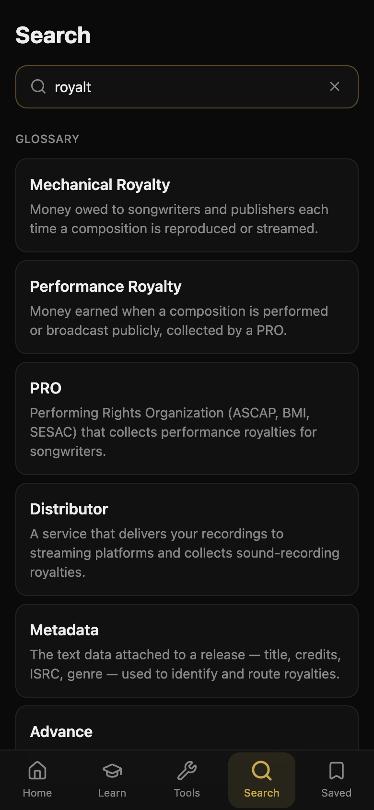

# Poseidon Academy

A mobile-first learning app for independent artists — the music business, explained in short lessons, with a glossary and interactive tools. Works fully offline.

Built with React + Vite + TypeScript, wrapped in Capacitor for iOS and Android.

---

## Screenshots

<div align="center">
  
  &nbsp;
  
  &nbsp;
  
</div>

<br/>

<div align="center">
  
  &nbsp;
  
  &nbsp;
  
</div>

<br/>

<div align="center">
  
  &nbsp;
  
</div>

---

## What it is

Poseidon Academy is a standalone mobile app (separate repo from the Poseidon Music Platform website). It takes the website's Resources section as inspiration and builds a focused, app-store-ready companion:

- **5-tab bottom navigation** — Home, Learn, Tools, Search, Saved
- **Lessons** — short structured articles across 6 topic categories
- **Glossary** — searchable A–Z accordion of music business terms
- **Release Checklist** — 8-week prep list with persistent progress
- **Bookmarks** — save any lesson to read later, stored offline
- **Global Search** — searches lessons and glossary simultaneously
- **No backend** — everything ships in the bundle, works offline

---

## Stack

| Layer | Tech |
|---|---|
| UI | React 19 + Vite + TypeScript |
| Styling | Tailwind CSS v4 |
| Animation | Framer Motion |
| Icons | Lucide React |
| Native shell | Capacitor 8 (iOS + Android) |
| Content | Bundled TypeScript — no backend |

Theme: gold (`#c9a94e`) on near-black (`#0a0a0a`), matching the Poseidon website.

---

## Animations

Every interaction is animated with Framer Motion spring physics:

- **Tab switching** — sliding gold pill indicator (FLIP animation via `layoutId`) + icon scale spring
- **Push navigation** — lessons and categories slide in from the right, exit to the right on back
- **Screen entrance** — all content staggers in with cascading fade-up (65ms between items)
- **Lesson body** — each block (heading, paragraph, list, callout) fades up sequentially
- **Glossary accordion** — height animates 0 → auto with spring; chevron rotates
- **Bookmark toggle** — springs in with rotation on every state flip
- **Checklist items** — checkmark springs in with a pop; progress bar uses GPU-safe `scaleX`
- **Search** — result sections fade in; clear button springs in/out; gold focus ring on input
- **Tools sub-navigation** — hub ↔ Glossary ↔ Checklist uses `AnimatePresence mode="wait"`

---

## Develop

```bash
npm install
npm run dev        # http://localhost:5173 — resize to ~390px width for phone preview
npm run build      # typecheck + production build
npm run lint
```

To preview on a real phone on the same WiFi, run `npm run dev -- --host` and open the network URL in your phone's browser.

---

## Native builds (Capacitor)

```bash
npm run build
npx cap add ios          # one-time, requires Xcode
npx cap add android      # one-time, requires Android Studio
npm run cap:ios          # build + sync + open Xcode
npm run cap:android      # build + sync + open Android Studio
```

App id: `com.poseidonholdings.academy`

---

## Content

All content lives in [`src/data/content.ts`](src/data/content.ts) — lessons, categories, and glossary terms. The current content is placeholder. See [`docs/CONTENT_GUIDE.md`](docs/CONTENT_GUIDE.md) for how to add or replace it.

Persistence: bookmarks → `poseidon.saved.v1`, checklist → `poseidon.checklist.release.v1` (both in `localStorage`, mapped to native WebView storage on device).

---

## Docs

- [CLAUDE.md](CLAUDE.md) — full project context, architecture, and decisions
- [docs/CONTENT_GUIDE.md](docs/CONTENT_GUIDE.md) — how to add lessons, categories, and glossary terms
- [docs/ROADMAP.md](docs/ROADMAP.md) — what's done and what's next

---

## Team

- **Yashmit Bhaverisetti** — Engineering
- **Johnytiger [TSR]** — Management
